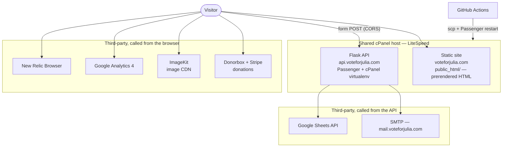
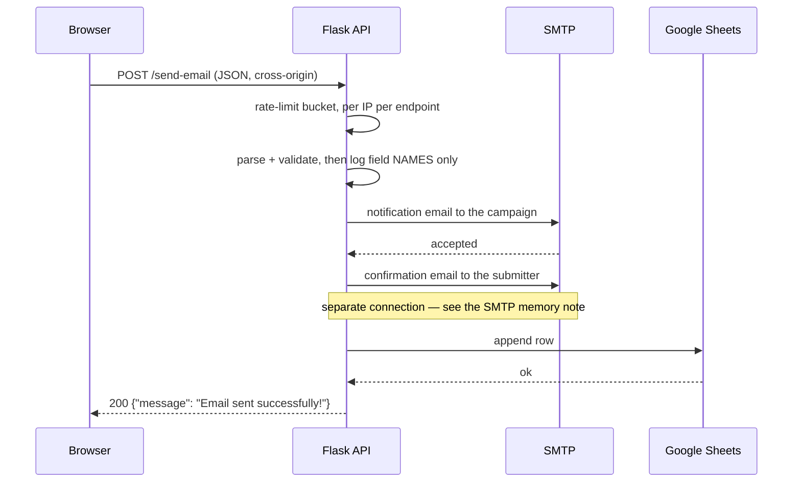

# Architecture

How the site is put together and why. This is the map; the reasoning behind each
choice lives in the [ADRs](adr/). For day-to-day work see
[conventions.md](conventions.md), [hosting.md](hosting.md), and
[donate-integration.md](donate-integration.md).

## The shape of it, in one paragraph

This is a campaign site for a single municipal race with a fixed content set, a
few hundred visitors on a good day, and a budget measured in tens of dollars a
month. It is a **prerendered static site plus one small Flask API**, both living
as cPanel apps on one shared LiteSpeed host. There is no database, no container
runtime, and no server-side rendering: pages are HTML files on disk, and the only
dynamic behaviour on the whole site is two form endpoints, which fan out to email
and a Google Sheet. Everything that would normally need infrastructure —
payments, images, analytics, error tracking — is a third-party service reached
directly from the browser.

## System context



Two things follow from this picture and explain most of the rest of the repo:

- **The browser talks to more origins than the API does.** That is why
  [public/.htaccess](../public/.htaccess) carries a long, carefully-ordered CSP —
  it is the only place third-party origins are governed. See
  [ADR-0010](adr/0010-edge-policy-in-htaccess.md).
- **The frontend and API are separate origins**, so every form post is a CORS
  request handled by `add_cors_headers` in [api/app.py](../api/app.py). See
  [ADR-0003](adr/0003-separate-api-subdomain.md).

## Components

| Component   | Lives in                                | Runtime                                    | Deployed by                                                                        |
| ----------- | --------------------------------------- | ------------------------------------------ | ---------------------------------------------------------------------------------- |
| Static site | [src/](../src/) → `dist/`               | Files on disk, served by LiteSpeed         | [deploy-production.yml](../.github/workflows/deploy-production.yml) frontend chain |
| Flask API   | [api/](../api/)                         | Passenger, cPanel virtualenv (Python 3.11) | the same workflow's API chain                                                      |
| Edge policy | [public/.htaccess](../public/.htaccess) | LiteSpeed config, read per request         | copied verbatim into `dist/`, uploaded as its own scp step                         |

### Frontend

Vue 3 + Vite, prerendered by **vite-ssg** into one flat `.html` per route. The
router and the sitemap both derive from a single list, `appRoutePaths` in
[src/lib/routePaths.ts](../src/lib/routePaths.ts) — that list is the reason
adding a page is a checklist rather than a file drop
([conventions.md](conventions.md#adding-a-page)).

The build hydrates into a normal SPA after load, so navigation is client-side,
but every route is also a complete HTML document a crawler can read without
running JavaScript ([ADR-0002](adr/0002-static-site-generation.md)). Two build
steps exist purely to protect that first paint: CSS is inlined into each HTML
file by an `onFinished` hook in [vite.config.ts](../vite.config.ts), and vendor
and `gtag` code are split into separate chunks.

### API

A single-file Flask app, [api/app.py](../api/app.py), with two POST endpoints
(`/send-email`, `/yard-sign`) and a `/health` GET. Both endpoints are the same
pipeline with different collaborators injected — `_handle_form_submission` takes
the parser, validator, email senders, and sheet-row mapper as arguments — so a
third form is a new route, not a new pipeline.

Layers, such as they are:

```
routes (app.py)
  └─ validation + models   (models.py)      — field limits, email shape, sheet rows
  └─ services              (services/)      — email_service.py, sheets_service.py
  └─ config                (config.py)      — env → frozen dataclasses, per-request
```

Config is read **per request** rather than at import, so a changed environment
variable takes effect on the next request without a Passenger restart, and a
malformed `SMTP_PORT` produces a JSON 500 instead of an import-time crash.

### Submission flow



The ordering is deliberate and load-bearing:

- **The notification email is the commit point.** If it is refused, the request
  fails with a 502 and the raw body is logged so the submission can be recovered
  by hand. Everything after it is best-effort in decreasing order of importance.
- **A failed confirmation email is a warning, not a failure** — the campaign
  already has the submission; the submitter merely misses a receipt.
- **A failed sheet append is a 502 with a distinct message** ("Email sent, but
  failed to save submission"), because at that point the data exists in someone's
  inbox and the sheet is out of step.
- **PII never enters the routine log.** `_log_request_fields` records which
  fields were filled, never their values; full bodies are logged only on the
  paths where the submission would otherwise be lost for good.

## Environments

|               | Production                           | Test                                           |
| ------------- | ------------------------------------ | ---------------------------------------------- |
| Site          | `voteforjulia.com` → `./public_html` | `test.voteforjulia.com` → `./public_html_test` |
| API           | `api.voteforjulia.com` → `./api`     | `test-api.voteforjulia.com` → `./api_test`     |
| Virtualenv    | `~/virtualenv/api/3.11/`             | `~/virtualenv/api_test/3.11/`                  |
| Deployed when | CI passes on `main`                  | CI passes on a PR branch                       |
| Source maps   | uploaded to New Relic, then stripped | linked, kept on the server                     |
| Indexing      | normal                               | `robots.txt` overwritten + `noindex` injected  |

Both live on the same host and share nothing but the machine — separate
document roots, separate cPanel apps, separate virtualenvs, separate env vars.
There is one test environment, so concurrent PR deploys are serialized by a
concurrency group and the most recently passing PR wins
([ADR-0007](adr/0007-shared-test-environment.md)).

Deploys stage into a scratch directory and promote it with two renames, so the
live root is never partially written and the previous build stays on disk as the
rollback ([ADR-0006](adr/0006-scp-deploy-with-atomic-swap.md)). Full mechanics in
[hosting.md](hosting.md).

## Cross-cutting concerns

**Security.** All response-header policy is in `.htaccess`
([ADR-0010](adr/0010-edge-policy-in-htaccess.md)). The API adds only CORS. There
are no user accounts, no sessions, and no cookies set by our code — the only
credentials in the system are server-side env vars (SMTP password, Google service
account), which is why the `$`-in-env-var trap in
[hosting.md](hosting.md#app-env-vars-must-not-contain-) matters so much.

**Abuse.** Per-IP, per-endpoint fixed-window rate limiting in process memory
([ADR-0009](adr/0009-in-process-rate-limiting.md)). No CAPTCHA — the forms are
low-value targets and a CAPTCHA would cost real conversions on a volunteer form.

**Observability.** New Relic Browser for client errors and Core Web Vitals, GA4
for traffic ([ADR-0011](adr/0011-browser-side-observability.md)), and the New
Relic Python agent in the Passenger app
([ADR-0013](adr/0013-server-side-apm.md)). Trace headers are allowed through
CORS and the API origins are listed in the browser agent's
`distributed_tracing.allowed_origins`, so a form submission is one trace from
the click to SMTP.

Two health endpoints, deliberately different. `/health` is liveness only — it
does not touch SMTP or Sheets, which is why both deploy pipelines can verify
against it without a mail blip failing a deploy, and why a green `/health` once
coexisted with every form on the site failing. `/health/deep` is the one a
synthetic monitor watches: it authenticates against SMTP and reads spreadsheet
metadata, and returns 503 when either is broken.

What is watched, what the alerts mean, and what to do when one fires is
[monitoring.md](monitoring.md); the dashboard and alert definitions themselves
are version-controlled in [monitoring/](../monitoring/).

**Testing.** Vitest for units, Cypress against the deployed test site for the two
form flows end to end (they submit real data and clean up after themselves), and
pytest for the API. The OpenAPI spec is kept honest by a test that diffs it
against the app ([api/test_openapi_spec.py](../api/test_openapi_spec.py)) rather
than by discipline.

## Decision records

| #                                               | Decision                                                        | Status                                            |
| ----------------------------------------------- | --------------------------------------------------------------- | ------------------------------------------------- |
| [0001](adr/0001-shared-hosting-over-aws.md)     | Shared LiteSpeed hosting instead of AWS S3 + ECS Fargate        | Accepted                                          |
| [0002](adr/0002-static-site-generation.md)      | Prerender the frontend with vite-ssg                            | Accepted                                          |
| [0003](adr/0003-separate-api-subdomain.md)      | Run the API on its own subdomain, cross-origin                  | Accepted                                          |
| [0004](adr/0004-no-database.md)                 | No database — email plus a Google Sheet is the system of record | Accepted                                          |
| [0005](adr/0005-outsource-donations.md)         | Outsource donations to Donorbox/Stripe                          | Accepted                                          |
| [0006](adr/0006-scp-deploy-with-atomic-swap.md) | Deploy by scp from GitHub Actions with an atomic directory swap | Accepted                                          |
| [0007](adr/0007-shared-test-environment.md)     | One shared test environment on the same host                    | Accepted                                          |
| [0008](adr/0008-pin-python-to-host.md)          | Pin Python to the host's interpreter                            | Accepted                                          |
| [0009](adr/0009-in-process-rate-limiting.md)    | Rate-limit in process memory                                    | Accepted                                          |
| [0010](adr/0010-edge-policy-in-htaccess.md)     | Keep security, caching, and URL policy in `.htaccess`           | Accepted                                          |
| [0011](adr/0011-browser-side-observability.md)  | Browser-side observability only                                 | Superseded by [0013](adr/0013-server-side-apm.md) |
| [0012](adr/0012-imagekit-for-images.md)         | Serve images from ImageKit rather than the host                 | Accepted                                          |
| [0013](adr/0013-server-side-apm.md)             | Instrument the API server-side, and alert on it                 | Accepted                                          |

New ADRs: see [adr/README.md](adr/README.md).
