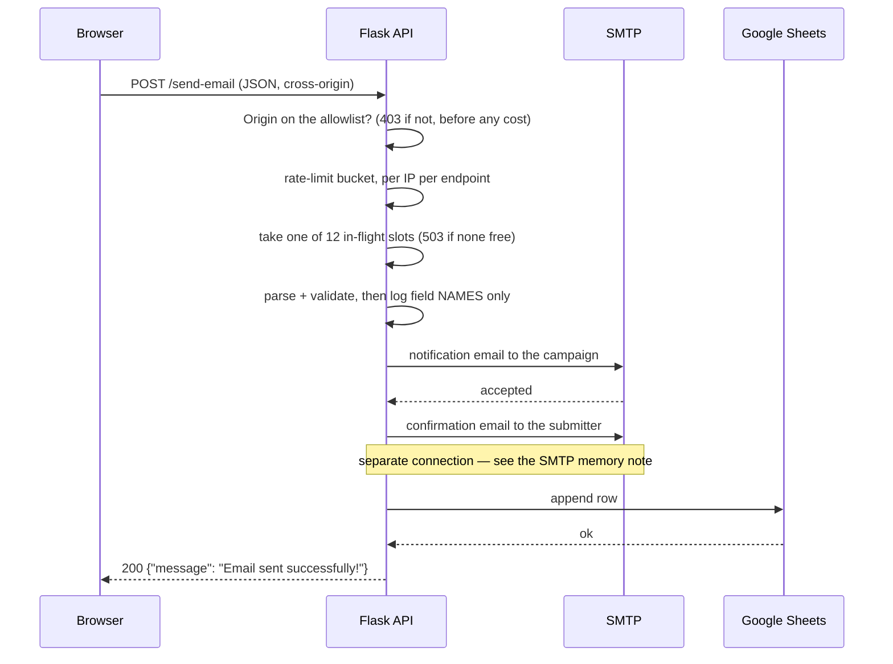

# Architecture

How the site is put together and why. This is the map; the reasoning behind each
choice lives in the [ADRs](adr/). For day-to-day work see
[conventions.md](conventions.md), [hosting.md](hosting.md), and
[donate-integration.md](donate-integration.md).

## The shape of it, in one paragraph

This is a campaign site for a single municipal race with a fixed content set, a
few hundred visitors on a good day, and a budget measured in tens of dollars a
month. It is a **prerendered static site plus one small Flask API**, both living
as cPanel apps on one shared LiteSpeed host. There is no database, no container
runtime, and no server-side rendering: pages are HTML files on disk, and the only
dynamic behaviour on the whole site is two form endpoints, which fan out to email
and a Google Sheet. Everything that would normally need infrastructure —
payments, images, analytics, error tracking — is a third-party service reached
directly from the browser.

## System context


Two things follow from this picture and explain most of the rest of the repo:

- **The browser talks to more origins than the API does.** That is why
  [public/.htaccess](../public/.htaccess) carries a long, carefully-ordered CSP —
  it is the only place third-party origins are governed. See
  [ADR-0010](adr/0010-edge-policy-in-htaccess.md).
- **The frontend and API are separate origins**, so every form post is a CORS
  request handled by `add_cors_headers` in [api/app.py](../api/app.py). See
  [ADR-0003](adr/0003-separate-api-subdomain.md).

## Components

| Component   | Lives in                                | Runtime                                    | Deployed by                                                                        |
| ----------- | --------------------------------------- | ------------------------------------------ | ---------------------------------------------------------------------------------- |
| Static site | [src/](../src/) → `dist/`               | Files on disk, served by LiteSpeed         | [deploy-production.yml](../.github/workflows/deploy-production.yml) frontend chain |
| Flask API   | [api/](../api/)                         | Passenger, cPanel virtualenv (Python 3.11) | the same workflow's API chain                                                      |
| Edge policy | [public/.htaccess](../public/.htaccess) | LiteSpeed config, read per request         | copied verbatim into `dist/`, uploaded as its own scp step                         |

### Frontend

Vue 3 + Vite, prerendered by **vite-ssg** into one flat `.html` per route. The
router and the sitemap both derive from a single list, `appRoutePaths` in
[src/lib/routePaths.ts](../src/lib/routePaths.ts) — that list is the reason
adding a page is a checklist rather than a file drop
([conventions.md](conventions.md#adding-a-page)).

The build hydrates into a normal SPA after load, so navigation is client-side,
but every route is also a complete HTML document a crawler can read without
running JavaScript ([ADR-0002](adr/0002-static-site-generation.md)). Two build
steps exist purely to protect that first paint: CSS is inlined into each HTML
file by an `onFinished` hook in [vite.config.ts](../vite.config.ts), and vendor
and `gtag` code are split into separate chunks. Both degrade silently if they
stop working, so CI budgets the resulting first-load weight and runs Lighthouse
over `dist/` ([performance.md](performance.md),
[ADR-0015](adr/0015-performance-budgets-in-ci.md)).

### API

A single-file Flask app, [api/app.py](../api/app.py), with two POST endpoints
(`/send-email`, `/yard-sign`) and a `/health` GET. Both endpoints are the same
pipeline with different collaborators injected — `_handle_form_submission` takes
the parser, validator, email senders, and sheet-row mapper as arguments — so a
third form is a new route, not a new pipeline.

`GET /` serves an easter egg: a mock configuration document for the campaign,
with a few of the candidate's favourite things about the city. It is decoration and no client reads
it, but it is not only decoration. The root is the most-requested path on the
origin and effectively none of that is traffic the site sent — it is scanners,
and it used to answer `404`. Replacing that stops sweeps being the loudest entry
in a log nobody was reading. A path that genuinely matches no route still
answers `404`.

**This passage used to claim a second effect, on the dashboard's API error tile
and the error-rate alert, and that claim is obsolete as of 2026-08-19.** Both
were counting `http.statusCode >= 400`, so scanner `404`s read as the API
failing, and the reasoning ran on to warn that arming `EDGE_TOKEN_ENFORCED`
([ADR-0020](adr/0020-authenticate-the-origin-path.md)) would convert those
sweeps into `403`s that the agent does not ignore by default — turning traffic
the alert had ignored into traffic it counted.

Client errors no longer reach either one. The tile is now
`percentage(count(*), WHERE http.statusCode >= 500)` and the alert that replaced
the error-rate condition counts only 5xx, for the reasons in
[ADR-0021](adr/0021-alert-on-signals-the-host-cannot-drop.md) — 4xx on this API
is overwhelmingly scanners and rate-limit refusals, which is the defences
working. **So arming the edge token has no monitoring consequence to weigh.**
The easter egg keeps the log-noise rationale and loses the telemetry one.

The document's shape is not a contract and nothing should parse it. The one part
that is load-bearing is the endpoint paths quoted inside it, which a test in
[api/test_app.py](../api/test_app.py) checks against the URL map so a renamed
route cannot leave it pointing at a 404.

Layers, such as they are:

```
routes (app.py)
  └─ validation + models   (models.py)      — field limits, email shape, sheet rows
  └─ services              (services/)      — email_service.py, sheets_service.py
  └─ config                (config.py)      — env → frozen dataclasses, per-request
```

Config is read **per request** rather than at import, so a changed environment
variable takes effect on the next request without a Passenger restart, and a
malformed `SMTP_PORT` produces a JSON 500 instead of an import-time crash.

### Submission flow



The ordering is deliberate and load-bearing:

- **The notification email is the commit point.** If it is refused, the request
  fails with a 502 and the raw body is logged so the submission can be recovered
  by hand. Everything after it is best-effort in decreasing order of importance.
- **A failed confirmation email is a warning, not a failure** — the campaign
  already has the submission; the submitter merely misses a receipt.
- **A failed sheet append is a 502 with a distinct message** ("Email sent, but
  failed to save submission"), because at that point the data exists in someone's
  inbox and the sheet is out of step.
- **PII never enters the routine log.** `_log_request_fields` records which
  fields were filled, never their values; full bodies are logged only on the
  paths where the submission would otherwise be lost for good.
- **Every outbound call is bounded by an explicit timeout.** `smtplib` and
  `httplib2` both default to waiting forever (they inherit
  `socket.getdefaulttimeout()`, which is `None`), so a third party that accepts
  a connection and then stalls would hold a worker open indefinitely — and
  Passenger spawns workers per request rather than capping them, so they
  accumulate. `SMTP_TIMEOUT_SECONDS` and `SHEETS_TIMEOUT_SECONDS` set the
  ceilings; Sheets gets the larger one because it runs after the mail is away.
- **The sheet append is one server-side call, not read-then-write.** Picking a
  row with a `values.get` and writing it with a `values.update` left a window
  where two simultaneous submissions chose the same row and the second erased
  the first, invisibly — both returned 200 and both submitters got a
  confirmation. `values.append` with `insertDataOption=INSERT_ROWS` resolves
  placement inside the write, and inserts rather than overwrites, so a row can
  land in an unexpected position but never on top of an existing one.
- **Scoping the range does _not_ scope the API's table detection**, and assuming
  it did cost four days of yard-sign requests (2026-08-01 to 2026-08-06). The
  range (`A:G`, the submission's own columns) says where the API starts looking;
  the table it finds is the contiguous block of data, and a column _outside_
  that range holding values further down stretches the table with it. On
  `Yard Signs` the `Paid` and `Delivered` checkbox columns had been filled to
  row 963 — a checkbox reads `FALSE` rather than empty in every cell it covers,
  so it is data — and submissions landed at 959 and 960, far below anything a
  human scrolls to, while the endpoint returned 200 and each submitter got their
  confirmation email. The append response's `tableRange` and
  `updates.updatedRange` are logged on every write so a recurrence is visible
  rather than silent, and both e2e specs now assert the new row is the _last_
  row of the sheet, which is the check that was missing: searching for the row
  by email finds it just as happily 900 rows out of place.
- **Nothing below the live rows may hold values, and that is a property of the
  spreadsheet, not of this code.** Clearing a checkbox is not enough — a
  checkbox cell with no value still reads `FALSE`, so the validation rule itself
  has to go. Keeping it that way is
  [sheets/checkbox-validation.gs](../sheets/checkbox-validation.gs), an Apps
  Script `onChange` trigger that puts a checkbox on a row if and only if that
  row holds a submission, and strips validation below the data. It exists for
  rows typed in by hand; rows the API appends need no help, because
  `INSERT_ROWS` inherits validation from the row above (verified 2026-08-06 — an
  append onto the cleaned sheet landed at row 29 with `Paid` and `Delivered`
  already `BOOLEAN`). Like [monitoring/](../monitoring/), the checked-in copy
  and the one running in the spreadsheet **drift**: nothing syncs them, so a
  change in one needs a matching change in the other.

## Environments

|               | Production                           | Test                                           |
| ------------- | ------------------------------------ | ---------------------------------------------- |
| Site          | `voteforjulia.com` → `./public_html` | `test.voteforjulia.com` → `./public_html_test` |
| API           | `api.voteforjulia.com` → `./api`     | `test-api.voteforjulia.com` → `./api_test`     |
| Virtualenv    | `~/virtualenv/api/3.11/`             | `~/virtualenv/api_test/3.11/`                  |
| Deployed when | CI passes on `main`                  | CI passes on a PR branch                       |
| Source maps   | uploaded to New Relic, then stripped | linked, kept on the server                     |
| Indexing      | normal                               | `robots.txt` overwritten + `noindex` injected  |

Both live on the same host and share nothing but the machine — separate
document roots, separate cPanel apps, separate virtualenvs, separate env vars.
There is one test environment, so concurrent PR deploys are serialized by a
concurrency group and the most recently passing PR wins
([ADR-0007](adr/0007-shared-test-environment.md)).

Deploys stage into a scratch directory and promote it with two renames, so the
live root is never partially written and the previous build stays on disk as the
rollback ([ADR-0006](adr/0006-scp-deploy-with-atomic-swap.md)). Full mechanics in
[hosting.md](hosting.md).

## Cross-cutting concerns

**Security.** All response-header policy is in `.htaccess`
([ADR-0010](adr/0010-edge-policy-in-htaccess.md)). The API adds only CORS. There
are no user accounts, no sessions, and no cookies set by our code — the only
credentials in the system are server-side env vars (SMTP password, Google service
account), which is why the `$`-in-env-var trap in
[hosting.md](hosting.md#app-env-vars-must-not-contain-) matters so much.

**Abuse.** Two per-IP, per-endpoint rate-limit tiers
([ADR-0009](adr/0009-in-process-rate-limiting.md),
[ADR-0016](adr/0016-second-tier-rate-limiting-and-honeypot.md)) — burst (5/60s)
and sustained (10/hour). Both count in SQLite under the app's `tmp/`, in one
transaction over one set of rows
([ADR-0024](adr/0024-count-every-rate-limit-tier-in-sqlite.md)), because
Passenger reaps idle workers and keeps several alive at once: a window held in
process memory restarts with them and is multiplied by them, which is how the
burst tier spent a year enforcing `5 x live workers`. Process memory now holds
only the refusals that store has issued, which keeps a flood off the disk
without being a limit anybody can be misled by. Both tiers fail open together,
because they are one call: a limiter that loses its database falls back to
holding the burst window in each worker — ADR-0009's original design, weaker but
not nothing — and leaves the hourly allowance unbounded until the file is
readable again. A failed database is then left alone for ten seconds rather than
asked again per request, because its five-second busy timeout would otherwise
hold a worker per request on exactly the path that exists to be cheap. Both forms also carry a
`display: none` honeypot field, which is the only one of these controls that
still works after an attacker changes IP. No CAPTCHA — the forms are low-value
targets and a CAPTCHA would cost real conversions on a volunteer form.

In front of all of them is an origin check
([ADR-0017](adr/0017-origin-trust-boundary-and-health-probe-cache.md)): a POST
whose `Origin` is present and not on the CORS allowlist is refused with `403`
before the limiter runs. It covers the case per-IP limiting is blind to by
construction — a page elsewhere auto-submitting the form from its visitors'
browsers, where every request arrives on a different victim's address and no
limit is ever approached. **The CORS allowlist alone never prevented this**: a
form-encoded POST is a CORS simple request, so it is sent with no preflight and
CORS only ever decided who could read the reply. An absent `Origin` is allowed,
because the callers that send none are the ones rate limiting does bound.

Above all of them sits a cap on **concurrent** submissions
([ADR-0018](adr/0018-cap-concurrent-submissions.md)): twelve at a time across
every worker, counted in the same SQLite store, with the overflow refused as
`503`. The others bound who may ask and how often; this bounds how much work
runs at once, which is a different question with a different trigger. A
submission holds a worker for as long as two SMTP connections and a sheet write
take, so the case it is really for is an upstream slowdown — where every holder
is a legitimate supporter and no rate limit is anywhere near being reached —
piling workers up against the host's memory cap.

Outside all of them is the edge itself
([ADR-0020](adr/0020-authenticate-the-origin-path.md)). Cloudflare stamps every
proxied request with a shared secret header, and both the frontend `.htaccess`
and a `before_request` hook in the API refuse anything arriving without it — so
a caller that reads the origin address off the MX record and connects directly
no longer reaches either. That decision also records why the obvious version,
an allowlist of Cloudflare's IP ranges, cannot work here: the host restores the
real client address before access control sees it, so the allowlist refuses the
proxy along with everyone else. Both enforcement points fail open until switched
on, and the secret is deployment state with no representation in the checkout.

**Observability.** New Relic Browser for client errors and Core Web Vitals, GA4
for traffic ([ADR-0011](adr/0011-browser-side-observability.md)), and the New
Relic Python agent in the Passenger app
([ADR-0013](adr/0013-server-side-apm.md)). Trace headers are allowed through
CORS and the API origins are listed in the browser agent's
`distributed_tracing.allowed_origins`, so a form submission is one trace from
the click to SMTP.

Two health endpoints, deliberately different. `/health` is liveness only — it
does not touch SMTP or Sheets, which is why both deploy pipelines can verify
against it without a mail blip failing a deploy, and why a green `/health` once
coexisted with every form on the site failing. `/health/deep` is the one a
synthetic monitor watches: it authenticates against SMTP and reads spreadsheet
metadata, and returns 503 when either is broken.

What is watched, what the alerts mean, and what to do when one fires is
[monitoring.md](monitoring.md); the dashboard and alert definitions themselves
are version-controlled in [monitoring/](../monitoring/).

**Testing.** Vitest for units, Cypress against the deployed test site for the two
form flows end to end (they submit real data and clean up after themselves) and
for the Donorbox widget on `/donate`, and pytest for the API. The OpenAPI spec is
kept honest by a test that diffs it
against the app ([api/test_openapi_spec.py](../api/test_openapi_spec.py)) rather
than by discipline.

## Decision records

| #                                                                | Decision                                                        | Status                                                                                                                                                                                      |
| ---------------------------------------------------------------- | --------------------------------------------------------------- | ------------------------------------------------------------------------------------------------------------------------------------------------------------------------------------------- |
| [0001](adr/0001-shared-hosting-over-aws.md)                      | Shared LiteSpeed hosting instead of AWS S3 + ECS Fargate        | Accepted                                                                                                                                                                                    |
| [0002](adr/0002-static-site-generation.md)                       | Prerender the frontend with vite-ssg                            | Accepted                                                                                                                                                                                    |
| [0003](adr/0003-separate-api-subdomain.md)                       | Run the API on its own subdomain, cross-origin                  | Accepted                                                                                                                                                                                    |
| [0004](adr/0004-no-database.md)                                  | No database — email plus a Google Sheet is the system of record | Accepted                                                                                                                                                                                    |
| [0005](adr/0005-outsource-donations.md)                          | Outsource donations to Donorbox/Stripe                          | Accepted                                                                                                                                                                                    |
| [0006](adr/0006-scp-deploy-with-atomic-swap.md)                  | Deploy by scp from GitHub Actions with an atomic directory swap | Accepted                                                                                                                                                                                    |
| [0007](adr/0007-shared-test-environment.md)                      | One shared test environment on the same host                    | Accepted                                                                                                                                                                                    |
| [0008](adr/0008-pin-python-to-host.md)                           | Pin Python to the host's interpreter                            | Accepted                                                                                                                                                                                    |
| [0009](adr/0009-in-process-rate-limiting.md)                     | Rate-limit in process memory                                    | Superseded by [0014](adr/0014-do-not-trust-forwarding-headers.md), [0016](adr/0016-second-tier-rate-limiting-and-honeypot.md) and [0024](adr/0024-count-every-rate-limit-tier-in-sqlite.md) |
| [0010](adr/0010-edge-policy-in-htaccess.md)                      | Keep security, caching, and URL policy in `.htaccess`           | Accepted                                                                                                                                                                                    |
| [0011](adr/0011-browser-side-observability.md)                   | Browser-side observability only                                 | Superseded by [0013](adr/0013-server-side-apm.md)                                                                                                                                           |
| [0012](adr/0012-imagekit-for-images.md)                          | Serve images from ImageKit rather than the host                 | Accepted                                                                                                                                                                                    |
| [0013](adr/0013-server-side-apm.md)                              | Instrument the API server-side, and alert on it                 | Accepted                                                                                                                                                                                    |
| [0014](adr/0014-do-not-trust-forwarding-headers.md)              | Trust a forwarding header only when one is configured           | Accepted                                                                                                                                                                                    |
| [0015](adr/0015-performance-budgets-in-ci.md)                    | Gate CI on performance budgets                                  | Accepted                                                                                                                                                                                    |
| [0016](adr/0016-second-tier-rate-limiting-and-honeypot.md)       | Add a persistent long-window rate limit and a form honeypot     | Accepted                                                                                                                                                                                    |
| [0017](adr/0017-origin-trust-boundary-and-health-probe-cache.md) | Refuse cross-site submissions, and cache the deep health probe  | Accepted                                                                                                                                                                                    |
| [0018](adr/0018-cap-concurrent-submissions.md)                   | Cap concurrent submissions, and close three smaller gaps        | Accepted                                                                                                                                                                                    |
| [0019](adr/0019-cloudflare-in-front.md)                          | Put Cloudflare in front of the web hostnames                    | Accepted                                                                                                                                                                                    |
| [0020](adr/0020-authenticate-the-origin-path.md)                 | Authenticate the edge-to-origin path with a shared secret       | Accepted                                                                                                                                                                                    |
| [0021](adr/0021-alert-on-signals-the-host-cannot-drop.md)        | Alert on signals the host cannot drop                           | Accepted                                                                                                                                                                                    |
| [0022](adr/0022-do-not-automate-the-candidates-alerts.md)        | Do not automate the candidate's alerts                          | Accepted                                                                                                                                                                                    |
| [0023](adr/0023-pin-the-deploy-host-key.md)                      | Pin the SSH host key on every step of the deploy pipeline       | Accepted                                                                                                                                                                                    |
| [0024](adr/0024-count-every-rate-limit-tier-in-sqlite.md)        | Count every rate-limit tier in SQLite                           | Accepted                                                                                                                                                                                    |

New ADRs: see [adr/README.md](adr/README.md).
